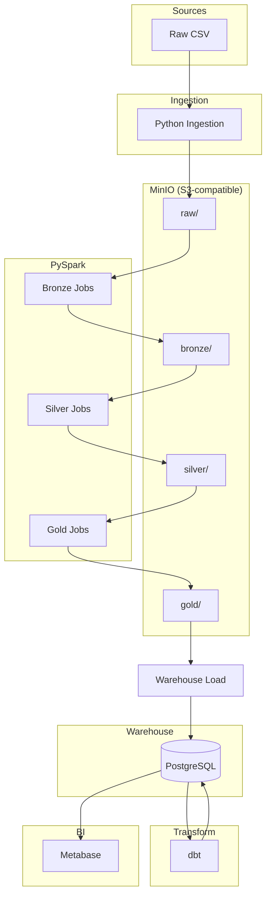

# Enterprise Retail Lakehouse Platform

> End-to-end data engineering platform for Australian enterprise retail analytics. Medallion architecture, PySpark, Airflow, dbt, and PostgreSQL—runnable locally with Docker.

[](LICENSE)

## Key Highlights

- **Medallion lakehouse** — Bronze → Silver → Gold with PySpark
- **Incremental processing** — Gold fact tables partition-based; warehouse facts use idempotent delete-by-load_date plus upsert
- **Apache Airflow** — End-to-end orchestration with parallel task groups
- **dbt + PostgreSQL** — Staging, intermediate, and marts with tests
- **Local-first, AWS-mappable** — MinIO + Postgres locally; S3 + RDS + Glue/MWAA in production

## Overview

A production-style data pipeline that ingests multi-source retail data, processes it through Bronze → Silver → Gold layers in an S3-compatible lake, loads analytics-ready tables into PostgreSQL, and models them with dbt for BI reporting.

**Target audience**: Data Engineers, Analytics Engineers, and hiring managers evaluating data platform skills.

## Architecture

```
Raw CSV → Ingestion → MinIO (raw) → PySpark Bronze → Silver → Gold → Warehouse Load → PostgreSQL → dbt → Metabase
         (all steps orchestrated by Apache Airflow)
```

| Layer | Technology | Purpose |
|-------|------------|---------|
| **Orchestration** | Apache Airflow | Schedules and coordinates ingestion, Spark, warehouse load, dbt |
| **Ingestion** | Python, MinIO client | Upload raw CSV to S3-compatible lake |
| **Bronze** | PySpark | Schema enforcement, deduplication, metadata |
| **Silver** | PySpark | Business curation, DQ guards, dimension joins |
| **Gold** | PySpark | Dimensions, facts, aggregated marts |
| **Warehouse** | Python, PostgreSQL | Full refresh for dimensions/marts; idempotent partition-based incremental (delete-by-load_date + upsert) for facts |
| **Transform** | dbt | Staging → intermediate → marts |
| **BI** | Metabase | Dashboards (optional) |

**Incremental design**: Gold `fact_sales` and `fact_inventory_daily` use partition-based incremental processing (only overwrite the `load_date` partition). Warehouse load: dimensions and marts use full refresh; facts use idempotent partition-based incremental loading (delete-by-load_date plus PostgreSQL upsert). See [warehouse/README.md](warehouse/README.md) for details.

See [Architecture Diagram](#architecture-diagram) below.

## Tech Stack

- **Lake**: MinIO (S3-compatible)
- **Processing**: PySpark (Medallion: Bronze → Silver → Gold)
- **Orchestration**: Apache Airflow
- **Warehouse**: PostgreSQL
- **Transform**: dbt-postgres
- **BI**: Metabase (optional)

## Quick Start

### Prerequisites

- Docker & Docker Compose
- Python 3.10+ (for local scripts)

### 1. Clone and configure

```bash
git clone <repo-url>
cd enterprise-retail-lakehouse
cp .env.example .env
```

### 2. Start infrastructure

```bash
docker compose up -d
```

Starts **MinIO** (console :9001, API :9000), **PostgreSQL** (:5432), and init containers that create buckets (`raw`, `bronze`, `silver`, `gold`) and schemas (`staging`, `marts`).

### 3. Run the pipeline

```bash
# Generate sample data (if needed)
python -m data_generator.src.generate_retail_data

# Ingest to MinIO
python -m ingestion.jobs.run_ingestion --load-date 2025-03-13

# Bronze (example)
spark-submit spark_jobs/jobs/bronze/ingest_customers.py --load-date 2025-03-13

# Silver, Gold, warehouse load, dbt — see module READMEs
```

Or orchestrate end-to-end with **Airflow** (see [airflow/README.md](airflow/README.md)).

### 4. Verify

```bash
make verify
```

## Project Structure

| Directory | Purpose |
|-----------|---------|
| `ingestion/` | Raw CSV → MinIO |
| `spark_jobs/` | Bronze, Silver, Gold PySpark jobs |
| `warehouse/` | Gold → PostgreSQL loader |
| `dbt/retail_analytics/` | dbt models (staging, intermediate, marts) |
| `airflow/dags/` | Pipeline DAG |
| `dashboards/` | Metabase dashboard specs |
| `data_generator/` | Sample retail data generator |
| `shared/` | Config, schemas, logging utils |

Full layout: [docs/PROJECT_STRUCTURE.md](docs/PROJECT_STRUCTURE.md)

## Architecture Diagram



## Module READMEs

- [spark_jobs/README.md](spark_jobs/README.md) — Bronze, Silver, Gold
- [warehouse/README.md](warehouse/README.md) — Warehouse load
- [dbt/retail_analytics/README.md](dbt/retail_analytics/README.md) — dbt models
- [airflow/README.md](airflow/README.md) — Orchestration
- [dashboards/README.md](dashboards/README.md) — Metabase dashboards

## Portfolio Assets

- [Architecture diagram](docs/ARCHITECTURE_DIAGRAM.md) (Mermaid)
- [AWS Production Mapping](docs/AWS_PRODUCTION_MAPPING.md) — Local vs AWS mapping, interview talking points
- [Resume project description](docs/RESUME_PROJECT_DESCRIPTION.md)
- [Interview talking points](docs/INTERVIEW_TALKING_POINTS.md)

## AWS Production Mapping

The project is **locally runnable** and **AWS-mappable**. Same design, different infrastructure:

| Local | AWS Production |
|-------|----------------|
| MinIO | Amazon S3 |
| PySpark (spark-submit) | AWS Glue or EMR Serverless |
| Apache Airflow | Amazon MWAA |
| PostgreSQL | Amazon RDS PostgreSQL |
| Metabase | QuickSight or self-hosted Metabase |

Set `STORAGE_BACKEND=s3` and S3 bucket env vars for AWS paths. See [docs/AWS_PRODUCTION_MAPPING.md](docs/AWS_PRODUCTION_MAPPING.md) for full mapping.

### How This Project Would Run in AWS

1. **S3**: Replace MinIO with S3 buckets; same s3a:// paths.
2. **Spark**: Submit jobs to Glue or EMR Serverless; same PySpark code.
3. **MWAA**: Migrate DAGs; replace spark-submit with Glue/EMR triggers.
4. **RDS PostgreSQL**: Same schema and dbt models; RDS chosen for operational analytics, dbt-postgres compatibility, and simpler ops. Redshift fits petabyte-scale.
5. **Warehouse load**: Run from MWAA or container; connect to RDS; use `GOLD_PATH=s3://...` with s3fs for direct S3 read.

## Why This Project

- **Medallion architecture** — Industry-standard lakehouse design
- **Local-first, AWS-mappable** — Full stack on Docker; config swap for S3/Glue/MWAA
- **Production patterns** — Modular design, config-driven, DQ guards
- **Australian context** — Retail domain, AUD, local assumptions

## License

MIT
