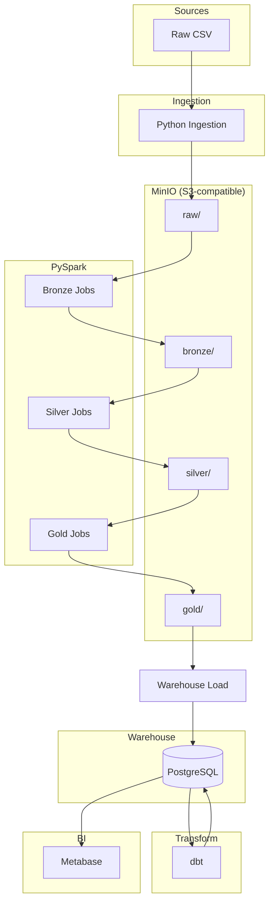

# Architecture Diagram

Retail Lakehouse end-to-end data flow (local stack). For AWS production mapping, see [AWS_PRODUCTION_MAPPING.md](AWS_PRODUCTION_MAPPING.md).

```mermaid
flowchart TB
    subgraph Sources
        CSV[Raw CSV]
    end

    subgraph Ingestion
        ING[Python Ingestion]
    end

    subgraph Lake["MinIO (S3-compatible)"]
        RAW[raw/]
        BRONZE[bronze/]
        SILVER[silver/]
        GOLD[gold/]
    end

    subgraph Spark["PySpark"]
        B[Bronze Jobs]
        S[Silver Jobs]
        G[Gold Jobs]
    end

    subgraph Warehouse
        PG[(PostgreSQL)]
    end

    subgraph Transform
        DBT[dbt]
    end

    subgraph BI
        MB[Metabase]
    end

    CSV --> ING --> RAW
    RAW --> B --> BRONZE
    BRONZE --> S --> SILVER
    SILVER --> G --> GOLD
    GOLD --> WL[Warehouse Load]
    WL --> PG
    PG --> DBT
    DBT --> PG
    PG --> MB
```
