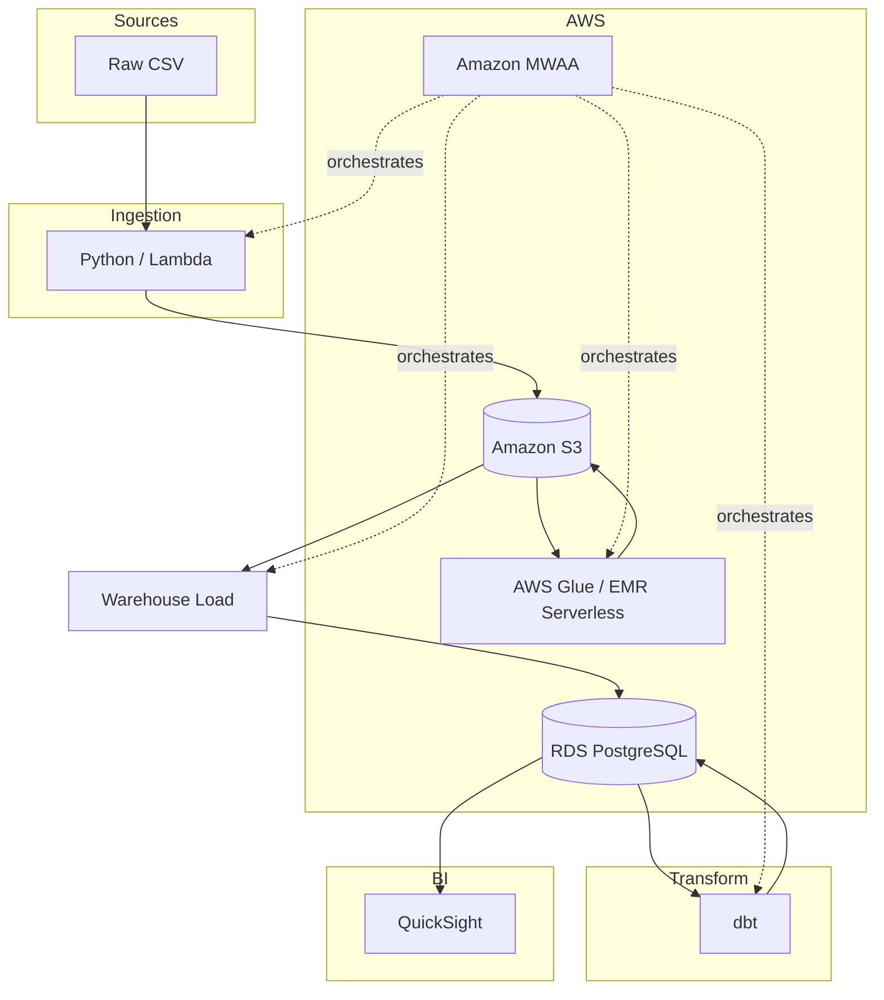

# AWS Production Mapping

How the local lakehouse maps to AWS production services. The project is **locally runnable** and **AWS-mappable**—same design, different infrastructure.

---

## Local Demo Stack vs AWS Production Stack

| Component | Local Demo | AWS Production |
|-----------|------------|----------------|
| **Object storage** | MinIO (S3-compatible) | Amazon S3 |
| **Spark jobs** | PySpark (spark-submit) | AWS Glue or EMR Serverless |
| **Orchestration** | Apache Airflow (self-hosted) | Amazon MWAA |
| **Warehouse** | PostgreSQL (Docker) | Amazon RDS PostgreSQL |
| **BI** | Metabase (optional) | QuickSight or self-hosted Metabase |

---

## AWS Architecture Diagram

---

## How This Project Would Run in AWS

1. **S3**: Replace MinIO buckets with S3 buckets. Set `STORAGE_BACKEND=s3`, `S3_BUCKET_RAW`, `S3_BUCKET_BRONZE`, etc. Same s3a:// paths; Spark uses default AWS credentials (IAM role, env).

2. **Spark**: Submit jobs to **AWS Glue** (Glue Jobs) or **EMR Serverless**. Same PySpark code; point to S3 paths. Glue fits serverless; EMR Serverless for larger workloads.

3. **Airflow → MWAA**: Migrate DAGs to **Amazon MWAA**. Same DAG code; MWAA runs in your VPC with managed Airflow. Replace `spark-submit` tasks with Glue/EMR job triggers.

4. **PostgreSQL → RDS**: Use **Amazon RDS PostgreSQL** for the warehouse. Same schema, dbt models, and warehouse loader. RDS chosen over Redshift for this project: smaller scale, lower cost, dbt-postgres compatibility, and simpler ops. Redshift fits petabyte-scale analytics.

5. **Warehouse load**: Run the Python loader from MWAA (or Lambda/ECS) with RDS connection. For S3→RDS, use `GOLD_PATH=s3://bucket/gold/` with s3fs, or sync Gold to EBS/EFS first.

6. **BI**: **QuickSight** connects to RDS. Or keep Metabase on ECS/EC2 for flexibility.

---

## Interview Talking Points: AWS Mapping

- **Why MinIO locally?** S3-compatible API; same Spark s3a:// paths work in AWS. No cloud cost for development; Docker keeps the stack portable.

- **Same design, different infra**: Medallion layout (raw/bronze/silver/gold) is identical. Swap MinIO→S3, add `STORAGE_BACKEND=s3` and bucket env vars; code paths stay the same.

- **Spark → Glue/EMR**: PySpark jobs run as Glue Jobs or EMR Serverless. Same JARs, same logic. Glue for serverless; EMR for more control or larger clusters.

- **Airflow → MWAA**: DAGs move as-is. MWAA provides managed Airflow; replace BashOperator spark-submit with Glue/EMR job triggers or use GlueJobOperator.

- **Warehouse in AWS**: RDS PostgreSQL for operational analytics and dbt. Loader runs from MWAA or a container; connects to RDS. For S3 Gold, use s3fs or sync step.
